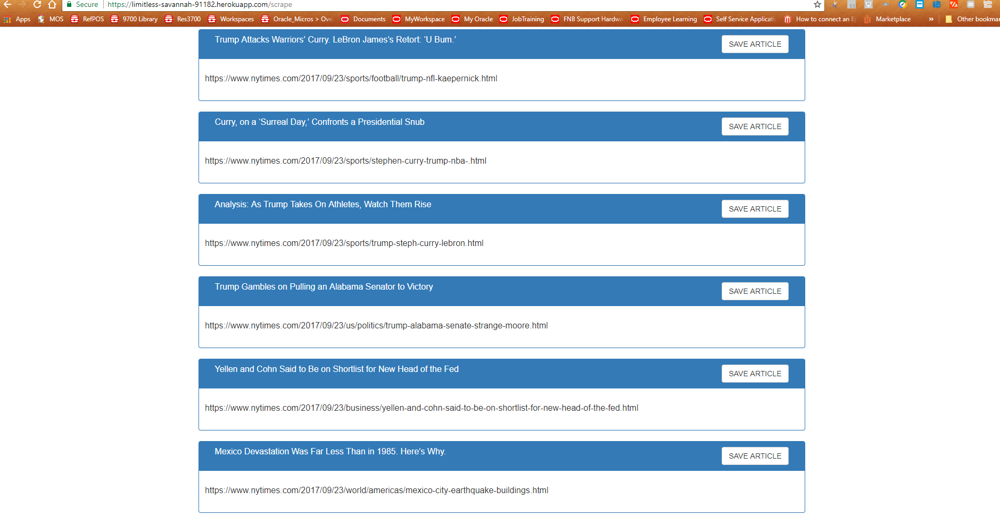

# cheerio-news-scraper

 A web app that lets users view and leave notes on the latest news. Used Mongoose and Cheerio to scrape news from a news site.
 This app utilizes RESTful API created using Node and MongoDB.
 
 [Please click here to visit the site deployed on Heroku.](https://limitless-savannah-91182.herokuapp.com/)

***

